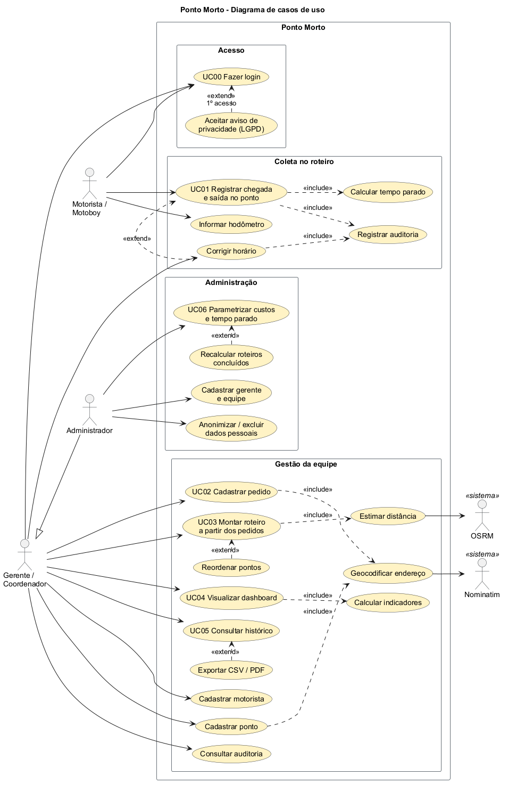
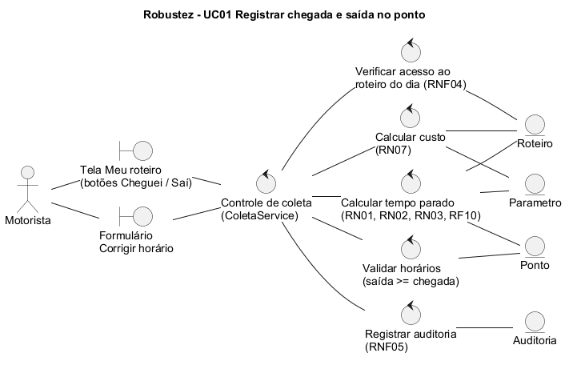
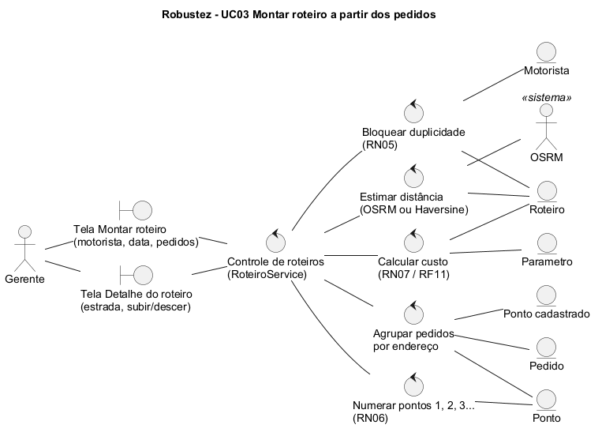
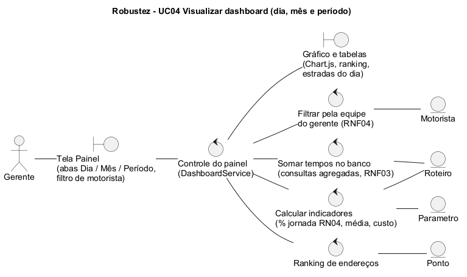
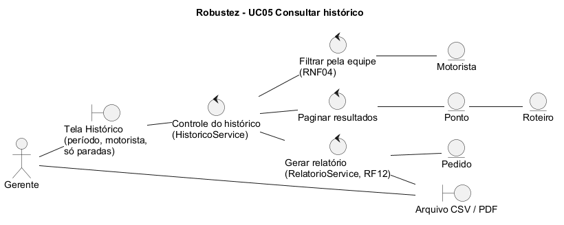
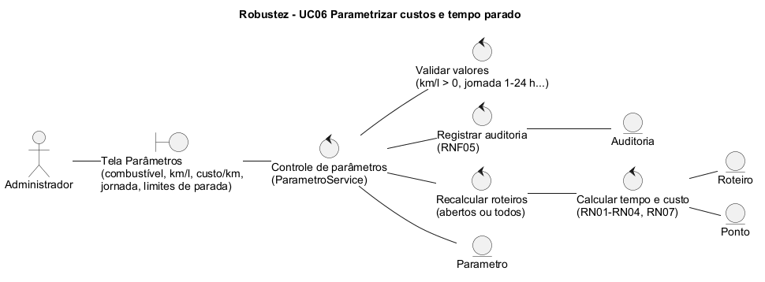
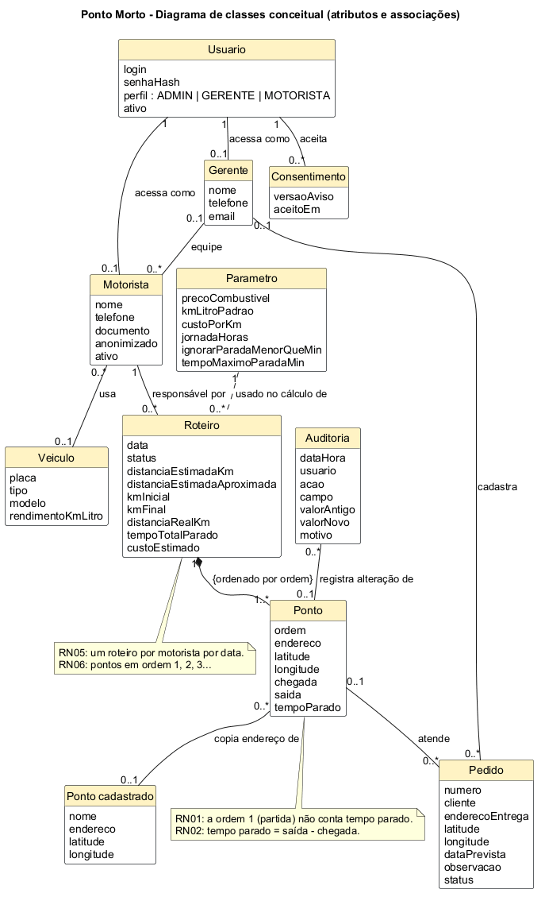

# Ponto Morto — Documento de especificação (Projeto Preliminar)

Engenharia de Software II · PUC Minas · Prof. Sandro Laudares
2º trabalho — 1ª parte: Projeto Preliminar

**Equipe:** Luana Ferreira Marques e Manuela Edmundo Moss

> **Ponto Morto**: o carro em ponto morto está parado. O sistema mostra onde e por quanto tempo motoristas e motoboys ficam parados durante o roteiro do dia.

---

## 1. Visão geral

### 1.1 Problema
Empresas de logística e de entrega urbana não sabem onde e por quanto tempo seus motoristas, motoboys e transportadores ficam parados durante o roteiro do dia. Sem esse registro, não é possível:

- achar os gargalos;
- renegociar prazos com clientes;
- calcular o custo real de cada rota.

### 1.2 Objetivo do MVP
- Identificar quanto tempo o profissional fica parado em cada ponto do roteiro diário.
- Registrar e guardar pontos, roteiros, pedidos e tempos coletados.
- Mostrar um painel com gráficos de tempo parado por dia, por mês e por período.
- Calcular indicadores de custo do trajeto (custo por km percorrido, consumo km/litro).

### 1.3 Escopo
| Dentro do escopo | Fora do escopo |
|---|---|
| Cadastros de motoristas/motoboys, gerentes, pontos, pedidos e roteiros | Roteirização automática ou otimização de rotas |
| Coleta de chegada e saída em cada ponto (botões "Cheguei" e "Saí") | Integração com folha de pagamento ou ERP |
| Cálculo do tempo parado por ponto e por roteiro | Rastreamento em tempo real (telemetria) |
| Histórico, painel (dia/mês/período) e relatórios CSV/PDF | Aplicativo nativo publicado em lojas |
| Parametrização de custos, regras de tempo parado e jornada | |

### 1.4 Atores
| Ator | Quem é | O que faz no sistema |
|---|---|---|
| **Motorista / Motoboy** | Profissional que executa o roteiro | Aceita o aviso de privacidade, registra chegada e saída em cada ponto, corrige horários do próprio roteiro do dia e informa o hodômetro |
| **Gerente / Coordenador / Dono** | Responsável por uma equipe | Cadastra pedidos, motoristas e pontos; monta roteiros; consulta painel, histórico, relatórios e auditoria **da sua equipe** |
| **Administrador** | Responsável pelo sistema | Tudo o que o gerente faz, para todas as equipes, e mais: parâmetros, cadastro de gerentes e pedidos LGPD (anonimizar/excluir) |
| Nominatim (sistema externo) | API gratuita do OpenStreetMap | Converte endereço em latitude e longitude |
| OSRM (sistema externo) | API gratuita de rotas | Informa a distância pelas ruas entre os pontos do roteiro |

O Administrador é uma **especialização** do Gerente (herda todos os casos de uso dele).

---

## 2. Regras de negócio

| Código | Regra |
|---|---|
| RN01 | O ponto de partida (ordem 1) não conta tempo parado; só conta a partir do 2º ponto. |
| RN02 | Tempo parado no ponto = horário de saída − horário de chegada (data e hora completas: vale para paradas que passam da meia-noite). |
| RN03 | Tempo total parado do roteiro = soma dos tempos de todos os pontos, menos o ponto de partida. |
| RN04 | Jornada padrão de 8 h por dia (parametrizável), base do percentual de tempo parado. No período, a base é uma jornada por roteiro. |
| RN05 | Cada roteiro pertence a um único motorista e a uma única data (duplicidade bloqueada no serviço e no banco). |
| RN06 | Os pontos do roteiro têm ordem sequencial (1, 2, 3...) que define o trajeto do dia. |
| RN07 | Custo do trajeto = (distância ÷ km/litro × preço do combustível) + (distância × custo por km). |
| Validações | A saída não pode ser antes da chegada; o km final do hodômetro precisa ser maior que o inicial. |
| RF10 | Paradas menores que X minutos contam zero; paradas maiores que o máximo contam só até o máximo e ficam sinalizadas (⚠). |
| Distância | **Estimada:** soma pelas ruas (OSRM), na ordem do roteiro; se a API não responder, usa a linha reta (Haversine) e marca como aproximada. **Real:** km final − km inicial do hodômetro. **O custo usa a real quando existe** e a estimada enquanto o roteiro não termina. |

---

## 3. Diagrama de casos de uso

Fonte: [`diagramas/casos-de-uso.puml`](diagramas/casos-de-uso.puml)

Relações usadas:

- **include:**
  - registrar chegada/saída inclui calcular tempo parado e registrar auditoria;
  - corrigir horário inclui registrar auditoria;
  - cadastrar pedido e cadastrar ponto incluem geocodificar endereço;
  - montar roteiro inclui estimar distância;
  - visualizar dashboard inclui calcular indicadores.
- **extend:**
  - aceitar aviso de privacidade estende o login (no 1º acesso do motorista);
  - corrigir horário estende registrar chegada/saída;
  - reordenar pontos estende montar roteiro;
  - exportar CSV/PDF estende consultar histórico;
  - recalcular roteiros concluídos estende parametrizar custos.

---

## 4. Descrição dos casos de uso

### UC00 — Fazer login
| | |
|---|---|
| **Ator** | Motorista, Gerente, Administrador |
| **Pré-condição** | O usuário está cadastrado e ativo. |
| **Pós-condição** | O usuário está autenticado com o seu perfil. |
| **Regras** | RNF04 (senha com BCrypt e acesso por perfil), RNF06 (aviso de privacidade no 1º acesso). |

**Fluxo principal**
1. O usuário informa e-mail e senha.
2. O sistema confere a senha (hash BCrypt).
3. O sistema direciona o usuário pelo perfil: o motorista vai para "Meu roteiro"; gerente e administrador vão para o painel.

**Fluxos alternativos**
- **A1 — Senha errada ou usuário inativo:** o sistema mostra "Usuário ou senha inválidos" e continua na tela de login.
- **A2 — Primeiro acesso do motorista (extend "Aceitar aviso de privacidade"):**
  1. O sistema mostra o aviso de privacidade.
  2. O motorista marca "Li e concordo" e confirma.
  3. O sistema grava o consentimento (versão do aviso e data/hora).
  4. Sem o aceite, o motorista não chega à tela de coleta.

### UC01 — Registrar chegada e saída no ponto
| | |
|---|---|
| **Ator** | Motorista |
| **Pré-condição** | O motorista está logado, aceitou o aviso de privacidade e tem roteiro para hoje (ou um roteiro de ontem ainda em andamento, quando a parada passou da meia-noite). |
| **Pós-condição** | Horários gravados, tempo parado recalculado e auditoria registrada. |
| **Regras** | RN01, RN02, RN03, RN07, RF05, RF06, RF10, RNF04, RNF05, validação saída ≥ chegada. |

**Fluxo principal**
1. O motorista abre "Meu roteiro". O sistema mostra:
   - o ponto atual, com endereço e pedidos;
   - a estrada do dia, com os pontos em ordem;
   - os botões grandes **Cheguei** e **Saí**.
2. No ponto de partida, o motorista toca **Saí**. O sistema grava o horário e o roteiro passa a "Em andamento". A partida não conta tempo parado (RN01).
3. Ao chegar ao ponto seguinte, o motorista toca **Cheguei**. O sistema grava o horário atual como chegada.
4. Ao sair, toca **Saí**. O sistema grava o horário e calcula o tempo parado do ponto (saída − chegada, RN02, com as regras do RF10).
5. O sistema recalcula o total parado do roteiro (RN03) e o custo estimado (RN07).
6. O sistema registra na auditoria quem registrou, quando e o valor novo.
7. Os passos 3 a 6 se repetem até o último ponto.
8. O motorista encerra o roteiro informando o km final do hodômetro. A distância real passa a ser usada no custo.

**Fluxos alternativos**
- **A1 — Tocou "Cheguei" antes de sair do ponto anterior:** o sistema recusa com a mensagem "Registre primeiro a saída do ponto N".
- **A2 — Tocou "Saí" sem ter tocado "Cheguei":** o sistema recusa com a mensagem "Registre a chegada antes da saída".
- **A3 — Corrigir horário (extend):**
  1. O motorista abre "Corrigir horário" no ponto e informa chegada, saída e o motivo.
  2. O sistema valida que a saída não é antes da chegada e recalcula os tempos.
  3. O sistema registra na auditoria o valor antigo, o valor novo e o motivo.
  4. O gerente também pode corrigir, pela tela do roteiro.
- **A4 — Saída antes da chegada:** o sistema recusa com a mensagem "A saída não pode ser antes da chegada".
- **A5 — Parada passa da meia-noite:** o cálculo usa data e hora completas. O roteiro de ontem continua aparecendo enquanto estiver em andamento.
- **A6 — km final menor ou igual ao inicial:** o sistema recusa com a mensagem "O km final precisa ser maior que o km inicial".
- **A7 — Ponto de outro motorista:** o acesso é negado (RNF04).

### UC02 — Cadastrar pedido (entrada de pedidos)
| | |
|---|---|
| **Ator** | Gerente (ou Administrador) |
| **Pré-condição** | Usuário logado como gerente ou administrador. |
| **Pós-condição** | Pedido gravado como "Aguardando roteiro", com coordenadas e ligado à equipe do gerente. |
| **Regras** | Número do pedido único; RF03 (geocodificação); RNF05 (auditoria). |

**Fluxo principal**
1. O gerente informa número, cliente, endereço de entrega, data prevista e observação.
2. O gerente clica em "Buscar coordenadas" (include "Geocodificar endereço"). O sistema consulta o Nominatim e mostra o ponto no mapa.
3. O gerente confere o mapa e ajusta o marcador, se precisar.
4. O sistema grava o pedido na equipe do gerente e registra a criação na auditoria.

**Fluxos alternativos**
- **A1 — Endereço não encontrado:** o sistema avisa. O gerente digita as coordenadas ou clica no mapa.
- **A2 — Coordenadas vazias ao salvar:** o sistema tenta geocodificar automaticamente.
- **A3 — Número repetido:** o sistema recusa com a mensagem "Já existe um pedido com o número X".
- **A4 — Editar pedido que já está em roteiro:** endereço e data não podem mudar.

### UC03 — Montar roteiro a partir dos pedidos
| | |
|---|---|
| **Ator** | Gerente (ou Administrador) |
| **Pré-condição** | Existem pedidos pendentes para a data e o motorista está ativo e na equipe do gerente. |
| **Pós-condição** | Roteiro gravado com os pontos em ordem. Os pedidos ficam "No roteiro". Distância estimada e custo são calculados. |
| **Regras** | RN05, RN06, RN07, RF04, RF11. |

**Fluxo principal**
1. O gerente escolhe a data. O sistema lista os pedidos pendentes previstos para aquela data.
2. O gerente escolhe o motorista, o ponto de partida (ponto cadastrado, por exemplo a base) e marca os pedidos.
3. O sistema verifica que o motorista ainda não tem roteiro nessa data (RN05).
4. O sistema cria o roteiro:
   - a partida vira o ponto 1;
   - cada endereço diferente vira um ponto, na ordem da lista (2, 3, 4...);
   - pedidos com o mesmo endereço ficam no mesmo ponto.
5. O sistema estima a distância pelas ruas com o OSRM (include "Estimar distância") e calcula o custo estimado (RN07).
6. O sistema mostra o roteiro como uma estrada horizontal, com a opção de reordenar.

**Fluxos alternativos**
- **A1 — Motorista já tem roteiro na data (RN05):** o sistema recusa e orienta a abrir o roteiro existente.
- **A2 — Reordenar pontos (extend):** o gerente usa ↑/↓. O sistema renumera tudo como 1, 2, 3... (RN06), reestima a distância e recalcula o custo.
- **A3 — OSRM não responde:** o sistema usa a linha reta (Haversine) e marca a distância como "aproximada".
- **A4 — Incluir mais pedidos ou pontos cadastrados depois:** o pedido vai para o ponto de mesmo endereço, se já houver um; senão, entra no fim do trajeto.
- **A5 — Remover ponto sem horário:** os pedidos do ponto voltam a ficar pendentes.
- **A6 — Roteiro concluído:** não pode ser reordenado.

### UC04 — Visualizar dashboard
| | |
|---|---|
| **Ator** | Gerente (ou Administrador) |
| **Pré-condição** | Usuário logado como gerente ou administrador. |
| **Pós-condição** | Nenhuma alteração nos dados (só consulta). |
| **Regras** | RF08, RN01, RN03, RN04, RN07, RNF03 (menos de 3 s para até 12 meses), RNF04 (a equipe). |

**Fluxo principal**
1. O gerente abre o painel. O sistema mostra o recorte **Dia**, na data mais recente com coleta.
2. O sistema calcula os indicadores (include "Calcular indicadores"):
   - tempo parado total;
   - média por roteiro;
   - % da jornada;
   - custo estimado;
   - distância real × estimada.
3. No recorte Dia, o sistema mostra:
   - o gráfico de tempo parado em cada ponto;
   - a tabela de paradas com endereço, chegada e saída;
   - o ranking de endereços;
   - a estrada de cada roteiro.
4. O gerente troca para **Mês** e o sistema mostra o tempo parado por dia do mês.
5. O gerente troca para **Período** (até 12 meses) e o sistema mostra:
   - o tempo parado por mês;
   - o ranking dos 10 endereços com mais tempo parado;
   - a comparação por motorista.

**Fluxos alternativos**
- **A1 — Filtrar por motorista:** todos os números e gráficos passam a considerar só esse motorista.
- **A2 — Período maior que 12 meses ou fim antes do início:** o sistema mostra a mensagem de erro e não consulta.
- **A3 — Recorte sem dados:** o sistema mostra "Nenhuma parada registrada neste recorte".
- **A4 — Ver os números em tabela:** cada gráfico tem sua versão em tabela, para acessibilidade.

### UC05 — Consultar histórico
| | |
|---|---|
| **Ator** | Gerente (ou Administrador) |
| **Pré-condição** | Usuário logado como gerente ou administrador. |
| **Pós-condição** | Nenhuma alteração nos dados. |
| **Regras** | RF07, RF12, RN01, RNF04. |

**Fluxo principal**
1. O gerente informa o período e, se quiser, o motorista.
2. O sistema lista, paginados, todos os pontos do período com:
   - data e motorista;
   - ordem e endereço;
   - chegada e saída;
   - tempo parado e situação ("partida (não conta)", "acima do máximo", "parada curta"...).
3. O gerente abre o roteiro de uma linha para ver o trajeto.

**Fluxos alternativos**
- **A1 — Só paradas:** o sistema esconde a partida e os pontos ainda sem tempo.
- **A2 — Exportar (extend):**
  - **CSV:** separador ";" e acentos corretos no Excel.
  - **PDF:** tabela com o período, o total parado e o destaque em amarelo do tempo parado.

### UC06 — Parametrizar custos e tempo parado
| | |
|---|---|
| **Ator** | Administrador |
| **Pré-condição** | Usuário logado como administrador. |
| **Pós-condição** | Novos parâmetros gravados e auditados. Roteiros recalculados. |
| **Regras** | RF09, RF10, RF11, RN04, RN07, RNF05, critério de aceitação 4. |

**Fluxo principal**
1. O administrador abre "Parâmetros". O sistema mostra os valores atuais e um exemplo da fórmula de custo.
2. O administrador altera:
   - valor do combustível;
   - km/l padrão;
   - custo por km;
   - jornada padrão;
   - "ignorar paradas menores que";
   - "tempo máximo por parada".
3. O sistema valida os valores (km/l > 0, jornada entre 1 e 24 h, mínimo < máximo...).
4. O sistema grava os parâmetros e registra na auditoria cada campo alterado, com o valor antigo e o novo.
5. O sistema recalcula os roteiros em aberto com os novos valores.

**Fluxos alternativos**
- **A1 — Recalcular também os concluídos (extend):** o sistema recalcula o histórico inteiro. Sem essa opção, o custo dos roteiros já concluídos continua com os valores da época.
- **A2 — Valor inválido:** o sistema mostra a mensagem e mantém o formulário preenchido.

### Casos de uso de apoio
| Caso de uso | Ator | Resumo | Regras |
|---|---|---|---|
| Cadastrar motorista e veículo | Gerente | Cria, lista, edita, desativa e exclui o motorista, com veículo (placa, tipo, km/l) e login. Motorista com histórico não é excluído: é desativado ou anonimizado. | RF01, RNF06 (documento mascarado nas listas) |
| Cadastrar ponto | Gerente | Endereço reaproveitável (ex.: base de partida), com geocodificação e ajuste no mapa | RF03 |
| Cadastrar gerente e equipe | Administrador | Nome, telefone, e-mail (login) e os motoristas sob sua responsabilidade | RF02 |
| Consultar auditoria | Gerente, Administrador | Lista quem alterou, quando, o campo, o valor antigo, o valor novo e o motivo. O gerente vê só a própria equipe. | RNF05 |
| Anonimizar / excluir dados pessoais | Administrador | Apaga nome, telefone, documento e login do profissional. Os tempos continuam nas estatísticas, sem identificação. Sem histórico, o cadastro é excluído de vez. | RNF06 |

---

## 5. Diagramas de robustez

Os diagramas usam **boundary** (telas e arquivos), **control** (lógica e regras) e **entity** (dados persistidos).

### 5.1 Registrar chegada e saída (UC01)

### 5.2 Montar roteiro a partir dos pedidos (UC03)

### 5.3 Visualizar dashboard (UC04)

### 5.4 Consultar histórico (UC05)

### 5.5 Parametrizar custos (UC06)

Fontes `.puml` na pasta [`diagramas/`](diagramas/).

---

## 6. Diagrama de classes conceitual

Fonte: [`diagramas/classes-conceitual.puml`](diagramas/classes-conceitual.puml)

### Decisões de modelagem
- **Veículo separado do Motorista.**
  - O rendimento km/l é do veículo, não da pessoa.
  - Se o motorista trocar de veículo, o histórico continua certo.
  - O roteiro guarda o km/l, o preço do combustível e o custo por km usados no cálculo.
- **Usuário separado.**
  - Login, senha (hash) e perfil ficam longe dos dados de cadastro.
  - O administrador não precisa de ficha de gerente.
  - Na anonimização, o login é apagado sem perder o histórico.
- **Auditoria como classe própria.**
  - Cada alteração vira um registro com o campo, o valor antigo e o valor novo.
  - Isso é mais claro que guardar cópias da linha inteira.
- **Ponto (parada do roteiro) × Ponto cadastrado.**
  - O "Ponto cadastrado" é um endereço reaproveitável (RF03).
  - O "Ponto" do roteiro copia o endereço e guarda horários e tempo parado. Mudar o cadastro não altera o histórico.
- **Pedido 0..* — 0..1 Ponto.** Vários pedidos podem cair no mesmo ponto (mesmo endereço).
- **Parâmetro.** Uma única linha, editável pela tela (RF09/RF10), usada no cálculo de todos os roteiros.

---

## 7. Glossário
| Termo | Significado |
|---|---|
| Roteiro | Trajeto de um motorista em um dia: a lista ordenada de pontos |
| Ponto | Parada do roteiro (endereço, ordem, chegada, saída, tempo parado) |
| Ponto de partida | Ponto 1 do roteiro; não conta tempo parado |
| Tempo parado | Saída − chegada em um ponto (com as regras de mínimo/máximo) |
| Jornada padrão | Horas de trabalho por dia (8 h), base do percentual |
| Distância estimada | Soma pelas ruas (OSRM) ou linha reta (Haversine, "aproximada") |
| Distância real | km final − km inicial do hodômetro |
| Geocodificação | Converter endereço em latitude e longitude |
